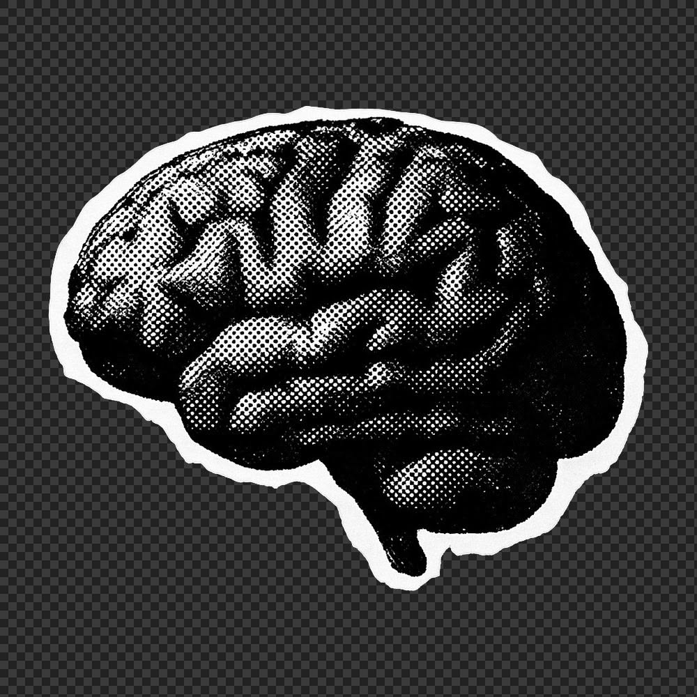
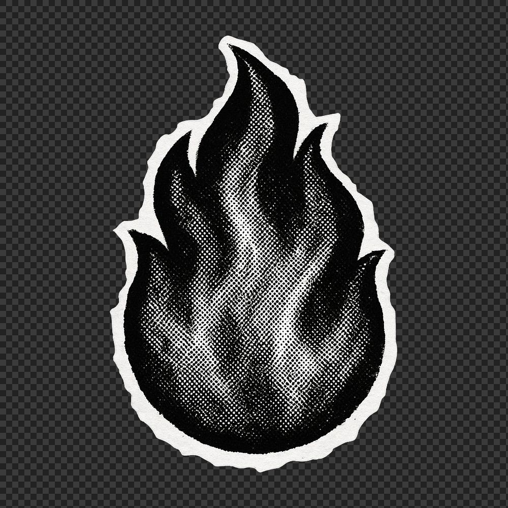

 

⭐ STARS &nbsp;&nbsp; 🍴 FORKS &nbsp;&nbsp; 👥 FOLLOWERS

---

<h2 align="center">Know About Me</h2>

 

**Hey there! I'm Obi**

I'm a full-stack developer and ML engineer with an obsession for building systems that actually work — and occasionally writing philosophy when the compiler disagrees with me. By day, I build end-to-end ML pipelines and production-ready web apps. By night, I write Python scripts to automate things I was too lazy to do manually. When I'm not coding, I'm either tweaking my Hyprland config for the fifteenth time or writing poems about why recursion is a metaphor for life.

 

---

<h2 align="center">Top Projects (built to avoid manual labor)</h2>

 

 &nbsp; Obsidian-powered second brain — because keeping knowledge in my head is a single point of failure.

 &nbsp; Real-time surveillance LLM — vision intelligence, fully offline, because the cloud can't be trusted.

 &nbsp; My Hyprland configuration. Pixel-perfect or completely broken — there is no in between.

 

---

<h2 align="center">Connect</h2>

 

 

> *Code is never finished. It only becomes slightly less terrible over time.*

> *Every commit I make is essentially just a small, desperate apology to my future self. Someday I will return to this codebase, look at the spaghetti I've written, and wonder who let me anywhere near a keyboard.*

---

<h2 align="center">Contribution</h2>

 

  

